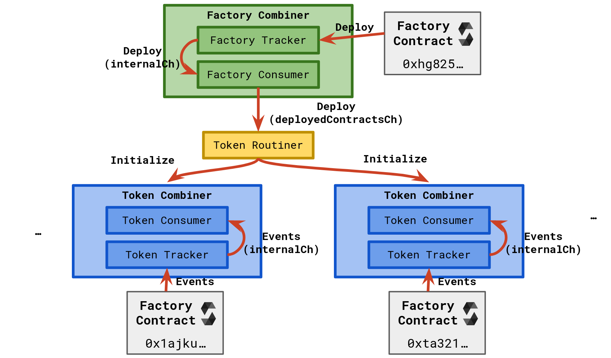

# Contract-tracker

## Description

Contract Tracker service is responsible for tracking events from factory and token contracts. You might read about service functionality in more details below.  

### Factory Tracker
- Listen to the newly deployed contracts.

### Token Tracker
- Listen to successful mint events, get book file ipfs hash, download file from the s3 storage and upload it to the IPFS using either _Pinata_ or _Infura_ clients.
- Listen to transfer events.
- Listen to update events.

The service contains metadata and files IPFS uploading logic. The uploader client is configurable. Currently, there is a support just for _Infura_ and _Pinata_ clients (_Infura_ is not recommended as it was proven to process files way too slowly)

## Tracking Flow

Tracking flow functions as follows: we firstly initialize a `factory_tracker` and `factory_consumer` for a factory contract using `factory_combiner`. That is, `factory_tracker` runs a web socket and when it catches a deploy event, sends it to the internal channel `internalCh`. Then the `factory_consumer` catches this event, processes it, and after that sends it to the deployed contracts channel `deployedContractsCh`. Then, the `token_routiner` catches this event and creates a separate `token_combiner` which includes a `token_tracker` and `token_consumer`, similarly to the `factory_combiner`. In some sense, `token_routiner` works as a manager of all goroutines, that is why it is called so :)




## Install

  ```bash
  git clone contract-runners
  cd 
  go build main.go
  export KV_VIPER_FILE=./config.yaml
  ./main migrate up
  ./main run service
  ```

## Documentation

We do use openapi:json standard for API. We use swagger for documenting our API.

To open online documentation, go to [swagger editor](http://localhost:8080/swagger-editor/) here is how you can start it
```bash
  cd docs
  npm install
  npm start
```
To build documentation use `npm run build` command,
that will create open-api documentation in `web_deploy` folder.

To generate resources for Go models run `./generate.sh` script in root folder.
use `./generate.sh --help` to see all available options.


## Running from docker 
  
Make sure that the docker is installed.
Use `docker run ` with `-p 8080:80` to expose port 80 to 8080

```bash
docker build -t contract-tracker .
docker run -e KV_VIPER_FILE=/config.yaml contract-tracker
```

## Running from Source

* Set up environment value with config file path `KV_VIPER_FILE=./config.yaml`
* Provide valid config file
* Launch the service with `migrate up` command to create database schema
* Launch the service with `run service` command


### Database
For services, we do use ***PostgresSQL*** database. 
You can [install it locally](https://www.postgresql.org/download/) or use [docker image](https://hub.docker.com/_/postgres/).


### Third-party services
- RPC and Websocket — [Alchemy](https://www.alchemy.com/) in this particular case.
- IPFS Uploader Client — either [Pinata](https://www.pinata.cloud/) or [Infura](https://www.infura.io/). We recommend using former.  

## Contacts

Dmytro Zakharov is responsible for this service. Can be contacted via the _Telegram_ (`@ZamDimon`)
